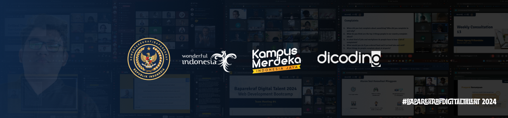

<h1> Repository Submission DICODING - Pemrograman Web </h1>

## **Table Of Contents**

[Description](#)

[Alternatife](#alternatife)

[Attention](#attention)

## **Description**

This module contains learning about Web Basics from HTML and CSS.

## **Alternatife**

You can view and download the source code of the submission at [Submission Pemweb](https://github.com/kevinsimorangkir21/Baparekraf-Digital-Talent-BDT-2024/archive/refs/tags/Pemweb.zip)

## **Attentention**
>
> **_WARNING: Make this repo a reference/reference not plagiarism._**
>
> - In accordance with the DICODING Terms of Use, the submission is your own work, not someone else's. Don't plagiarize!
>
> - Submissions do not plagiarize from any source (ex: Github, Blogger, or others). It is only used as a reference.
